  

  

  <blockquote><i>"Not sure if I'm good — I just do me, and I do fun stuff."</i> <b>— goldstac</b></blockquote>

## 🌐 Socials

  
  
  

  
  
  

## 🧰 Main Tech Stack

  
  
  
  
  
  
  
  
  
  
  
  
  

  <i>"I don't stick to one stack — I do everything, and I try everything."</i> — goldstac

## 💫 Vibe Check

  
  
  
  

## 🧭 About

  <table>
    <tr>
      <td align="center">
        <h3>🐧 Linux Enthusiast</h3>
        
<i>Building in the open, one dotfile at a time.</i>

      </td>
      <td align="center">
        <h3>🌐 Open-Source Advocate</h3>
        
<i>Open source isn't just code — it's a mindset.</i>

      </td>
      <td align="center">
        <h3>🤖 AI-Native Developer</h3>
        
<i>Heavy AI-native development, shipped daily.</i>

      </td>
    </tr>
  </table>

## 🚀 Featured

  <table>
    <tr>
      <td>
        
      </td>
      <td>
        
      </td>
    </tr>
  </table>

## 📊 GitHub Stats

  <table>
    <tr>
      <td>
        
      </td>
      <td>
        
      </td>
    </tr>
    <tr>
      <td>
        
      </td>
      <td>
        
      </td>
    </tr>
  </table>

## 📈 Contribution Graph

  

✦ ✦ ✦

## ☕ Support / Donations

  
If you'd like to support me, please consider donating:

  

✦ ✦ ✦

  made with 🖤 and arch (btw) · © 2026 Li Productions · built in the open

